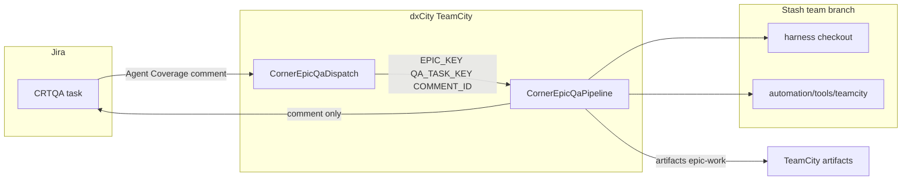

# Architecture — Corner Epic QA CI

## Overview

Two TeamCity configurations cooperate: **Dispatch** discovers work in Jira; **Pipeline** checks out the harness, bootstraps agent tooling, runs Cursor agents for four pipeline stages, probes CRTQA console over OpenSSH, verifies each stage, and posts a Jira comment.

## Dual repository model

| Workspace | Purpose |
|-----------|---------|
| **Local `cursor.corner`** | Full harness development (personal/team/public tiers via `/clean`) |
| **Stash `AI/agentic-feature-helper` branch `team`** | What dxCity Pipeline checks out |

TeamCity VCS root must track **`team`** on Stash. Maintainer pushes harness changes there before expecting CI to pick them up. GitHub `team` remote is a mirror only — see [rollout-learnings.md](rollout-learnings.md).

## Dispatch → Pipeline handoff

Dispatch passes three configuration parameters when queuing Pipeline:

| Parameter | Example | Source |
|-----------|---------|--------|
| `EPIC_KEY` | `CRT-671` | Parsed from CRTQA summary |
| `QA_TASK_KEY` | `CRTQA-10241` | Jira issue key |
| `COMMENT_ID` | `4466772` | Jira comment id (audit / dedup trace) |

Dedup is **Dispatch-only**: `dispatch-state/processed_comment_ids.txt` stores lines `CRTQA-10241#4466772`. Pipeline does not re-check dedup.

## Pipeline internal flow

1. **Verify + bootstrap** — harness tree, `jq`, self-install `uv`/`cursor-sdk`, `.cursor/mcp.json`, Jira smoke ([`verify-checkout.sh`](../tools/teamcity/verify-checkout.sh)).
2. **EPIC-PREP** agent ([`run_pipeline_agent.py`](../tools/teamcity/run_pipeline_agent.py)) + `epic_prep_verify.py`.
3. **COVERAGE** agent + `coverage_verify.py --mode draft_truth`.
4. **Console gate** — `crtqa_console_probe.py` via OpenSSH (Linux agents).
5. **GROUND** agent (with same CRTQA env as step 4) + `ground_verify.py --mode emit`.
6. **ANALYSE** agent + `analysis_verify.py --mode draft_truth`.
7. **Jira success** comment (step 11) — green path only.
8. **Jira failure** comment (step 12) — failed path; script guard if step 11 already posted — see [jira-integration.md](jira-integration.md).

## Optional Console Gate build

Standalone configuration runs only [`console-gate-wrapper.sh`](../tools/teamcity/console-gate-wrapper.sh) to validate CRTQA SSH secrets before wiring step 4 into Pipeline. See [crtqa-console-ci.md](../docs/crtqa-console-ci.md).

## vs `/epic-helper`

| Aspect | `/epic-helper` (IDE) | Corner Epic QA CI |
|--------|----------------------|-------------------|
| Trigger | Operator slash command | Jira comment on CRTQA |
| Human gates | Env + coverage review + scenario groups | **None in v1** |
| Chain | Full draft+truth through CLOSE | Stops at **ANALYSE** |
| MCP / rules | Cursor project + MCP | Inline MCP + `setting_sources=["project"]` in runner |
| Deliverables | Epic folder in repo | TeamCity **`epic-work`** artifact + Jira comment |

## Green build ≠ gold quality

A **successful** TeamCity build means verifiers exited 0 and Jira success posted. It does **not** guarantee operator-gold coverage or analysis — strict gates catch shape errors, not completeness. Fast runs with low `mcp_tool_started` or small artefact files warrant human review — see [operations.md](operations.md).
