# CRTQA stats

- Mode: `full_refresh`
- Generated: `2026-05-19T14:00:00.000000Z`
- User: `arodzevich`
- Report profile: `task_detail`
- Counts: corpus `1`, comparison `1`
- Representable cells: `0` (corpus n ≥ 4)

Per-task draft vs logged only; corpus benchmark not yet representable.

Corpus = manual baseline; comparison = AI-assisted (agentic epic helper). Association, not causation.

## Task-level

| Issue | Role | Category | Size | Draft h | Devex SP | Logged h | vs draft | vs corpus | Attribution |
|---|---|---|---|---:|---:|---:|---:|---:|---|
| CRTQA-10034 | corpus | Frontend / UI | 1–2 SP | 16.00 | 2.00 | 14.67 | 1.33 | — | baseline (corpus) |
| CRTQA-10132 | comparison | Backend / console | 1–2 SP | 16.00 | 2.00 | 13.00 | 3.00 | — | vs draft estimate only |

## Chart: draft estimate vs logged

```mermaid
xychart-beta
  title "Draft estimate vs logged (hours)"
  x-axis ["CRTQA-10034", "CRTQA-10132"]
  y-axis "Hours" 0 --> 20
  bar "Draft estimate" [16.0, 16.0]
  bar "Logged" [14.67, 13.0]
```



## Chart: longitudinal (comparison vs draft)

```mermaid
xychart-beta
  title "Sum hours under draft (comparison tasks)"
  x-axis ["0519T121732Z", "0519T121732Z", "0519T121732Z"]
  y-axis "Hours" 0 --> 4
  line "vs draft (sum)" [0.0, 3.0, 3.0]
```

## Primary table (category × size)

| Category | Size | Corpus n | Corpus median h | Comparison n | Comparison median h | Saved % | Evidence |
|---|---|---:|---:|---:|---:|---:|---|
| Backend / console | 1–2 SP | 0 | — | 1 | 13.00 | benchmark pending (need 4 more corpus tasks) | pending |
| Frontend / UI | 1–2 SP | 1 | 14.67 | 0 | — | benchmark pending (need 3 more corpus tasks) | directional |

## Category-only rollup

| Category | Corpus n | Corpus median h | Comparison n | Comparison median h | Median vs draft (cmp) | Saved % | Evidence |
|---|---:|---:|---:|---:|---:|---:|---|
| Backend / console | 0 | — | 1 | 13.00 | 3.00 | benchmark pending (need 4 more corpus tasks) | pending |
| Frontend / UI | 1 | 14.67 | 0 | — | — | benchmark pending (need 3 more corpus tasks) | directional |

## Footer

- Caveat: observed time differences are associative, not causal. `estimate_only` means under draft hours, not proven AI causation.
- Attribution: `none` = baseline (corpus); `insufficient` = insufficient data; `estimate_only` = vs draft estimate only; `corpus_benchmark` = vs manual baseline; `corpus_and_estimate` = vs draft and baseline
- Skipped epics: `CRT-602, CRT-634, CRT-635, CRT-663`.
- Epics marked comparison (AI-assisted on first run): `CRT-639`.
- After v4 upgrade: run `mode=full_refresh` once to reload draft estimates from Jira `customfield_11250`.
