# CRTQA stats

- Mode: `initial_assessment`
- Generated: `2026-05-08T09:32:19Z`
- User: `arodzevich`
- Counts: assisted `1`, manual `1`, unknown `0`
- Evidence: `weak`

```mermaid
xychart-beta
  title "Median logged hours by category"
  x-axis ["functional_market_data_fx", "functional_settlement_metrics"]
  y-axis "Hours" 0 --> 15
  bar "Assisted" [0, 13]
  bar "Manual" [14.67, 0]
```

| Category | Assisted n | Manual n | Unknown n | Assisted median h | Manual median h | Delta % | Evidence |
|---|---:|---:|---:|---:|---:|---:|---|
| functional_market_data_fx | 0 | 1 | 0 | — | 14.67 | — | weak |
| functional_settlement_metrics | 1 | 0 | 0 | 13.00 | — | — | weak |

- Caveat: observed time differences are associative, not causal.
- New keys this run: `CRTQA-10034`, `CRTQA-10132`.
- Skipped epics: `CRT-602`, `CRT-634`, `CRT-635`, `CRT-663`.
